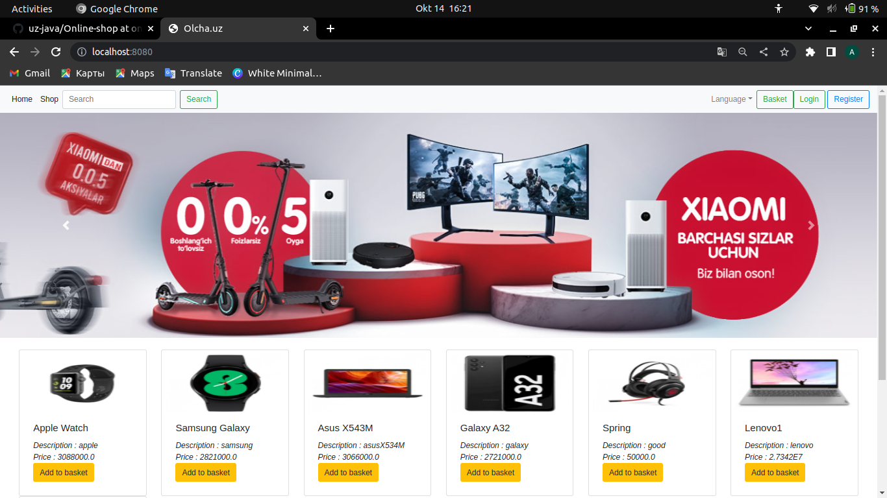
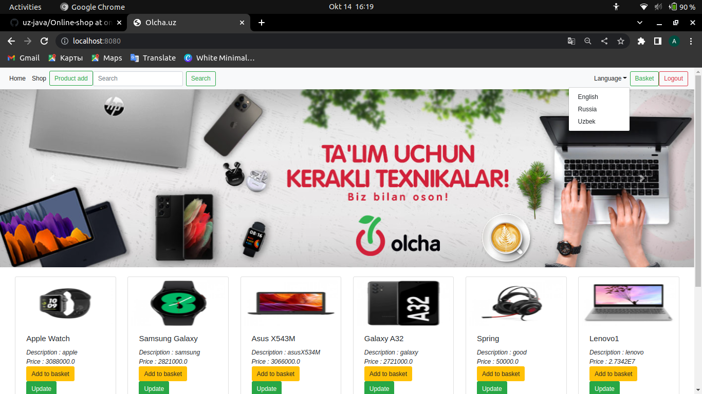
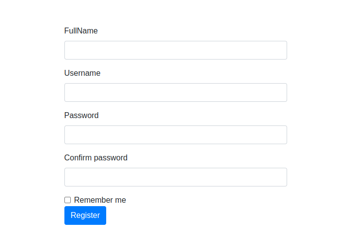
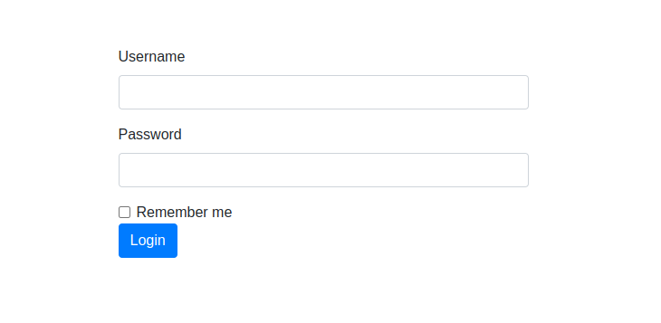
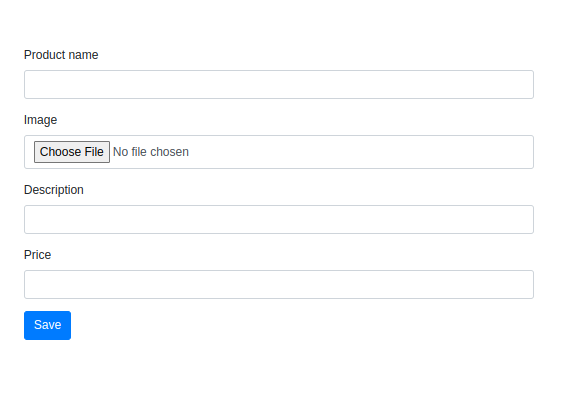
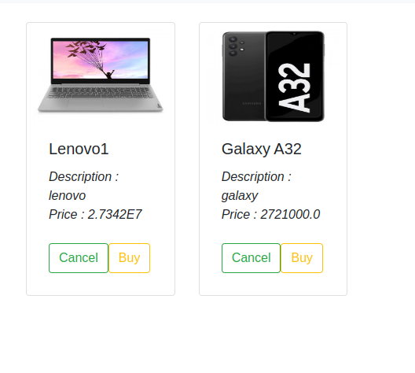

# Online shop


Online shop is a web application built by using JAVA CORE, Spring Framework with MVC architecture. On the database side, PostgreSQL Server has been used.


------------

#### Use Case - Complete Shopping from Scratch:
- Firstly, must be logged in to the website by using the Login/Register button on the navigation bar.
- To explore the products, the Products button must be clicked. And, the required products are added to Cart.
- Then, when clicked to the Cart button, all the shopping items, their prices and total price appear on the page. Changes can be done in this stage by increasing the quantity of the products or deleting them.
- To proceed to the payment stage, Complete the Shopping button must be clicked.
- Following the Cart confirmation, a new form appears. Information of Address, Credit Card Number is typed.
- The code that has been sent to the registered phone number is typed. (No code being sent to the user, it's just the template for now)
- Finally, Order Summary is created and welcomed to the Customer. If the details of the Order is required, the Order Details button must be clicked.

### datasource config
```
spring.datasource.url=jdbc:postgresql://localhost:5432/ProjectName
spring.datasource.username=username
spring.datasource.password=password
spring.datasource.driver=org.postgresql.Driver
        
```
<br>

### hibernate config
```
hibernate.dialect=org.hibernate.dialect.PostgreSQLDialect
hibernate.show_sql=true
hibernate.hbm2ddl.auto=update
hibernate.cache.use_second_level_cache=false
hibernate.cache.use_query_cache=false
hibernate.maximum.pool.size=20
hibernate.idle.count=10
hibernate.idle.timeout=600000
        
```
<br>

### Dependencies that we will need
```
         <dependency>
            <groupId>org.springframework</groupId>
             <artifactId>spring-webmvc</artifactId>
            <version>5.3.21</version>
        </dependency>
        <dependency>
            <groupId>javax.servlet</groupId>
            <artifactId>servlet-api</artifactId>
            <version>2.5</version>
        </dependency>
        
```

------------

### Home Page
------------



 ### Register Page
------------


 ### Login Page
------------


 ### Product add Page
------------


### Cart Screen
------------


### Basket Screen
------------

